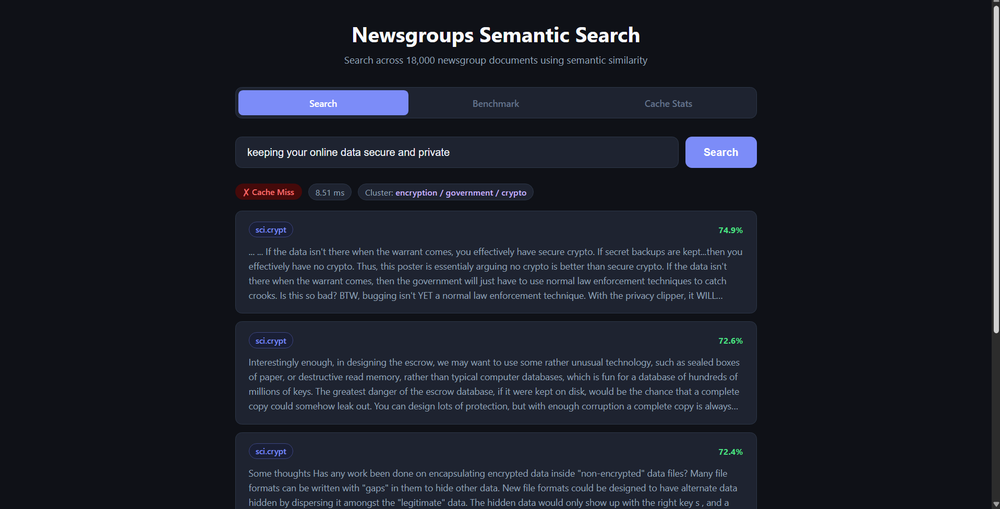
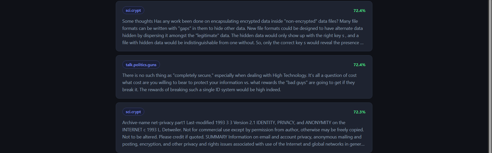
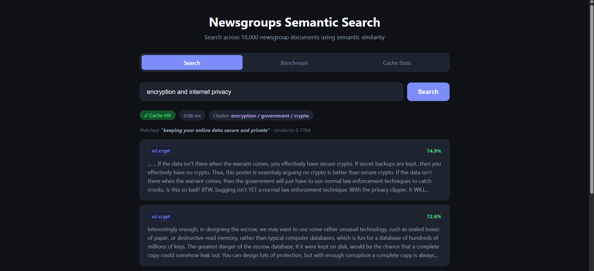
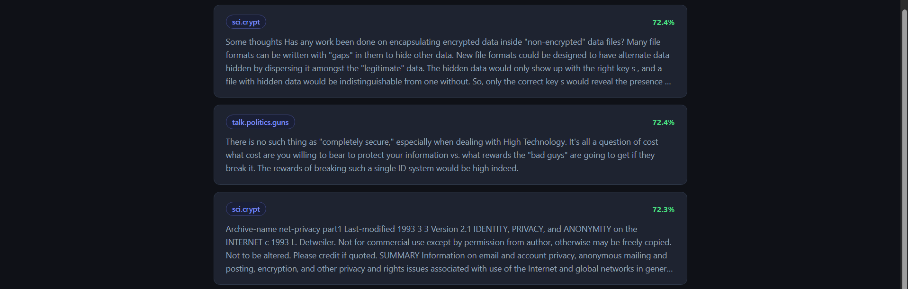
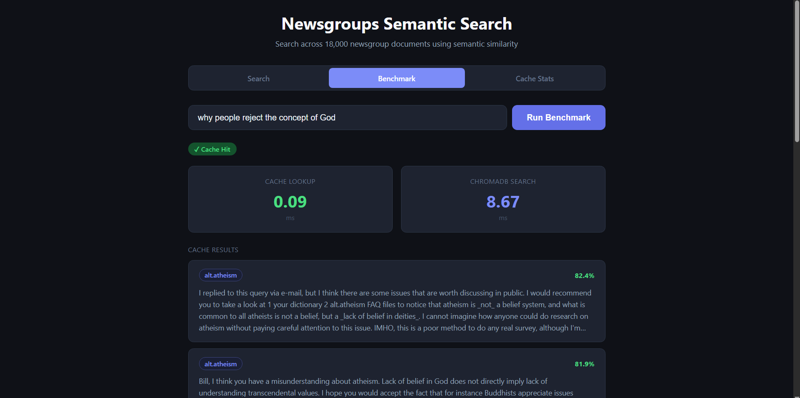
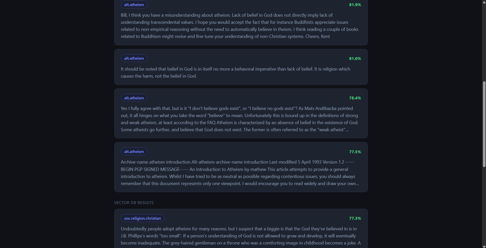
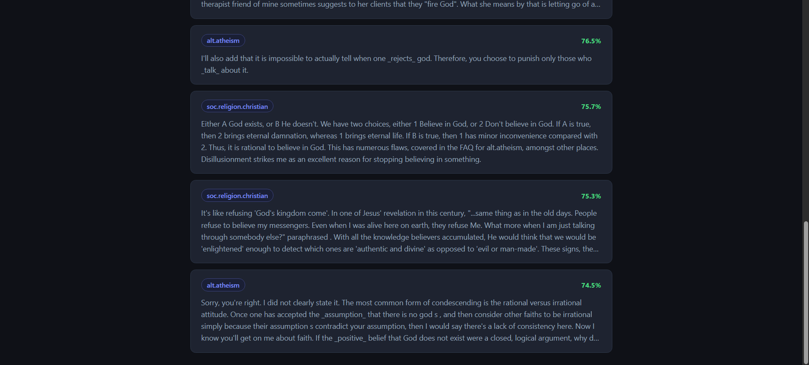

# Newsgroups Semantic Search

A semantic search engine over the 20 Newsgroups corpus (~18,000 documents). Type a natural language query and get back the most semantically similar documents — fast, with semantic caching that recognises paraphrased queries.

---

## What Makes This More Than a Basic Vector Search

- **Semantic cache with cluster-aware lookup** — stores past query embeddings in a Python dict, narrowed to the query's top-3 closest topic clusters before comparing similarity; if a new query is similar enough (cosine similarity ≥ 0.65) to a cached entry in those clusters, returns the cached result without touching the vector DB
- **Two-stage UMAP + Fuzzy C-Means clustering** — groups documents into 15 soft topic clusters; each document gets a probability distribution over clusters, not a single hard assignment
- **Retrieval timing** — every response includes `retrieval_time_ms` showing exactly how long the cache lookup or vector DB search took
- **Benchmark endpoint** — runs both cache and ChromaDB for the same query and returns both timings and both result sets side by side

---

## See It In Action

### Cache Miss — New Query

Query: `"keeping your online data secure and private"` — never seen before, so the cache has no match. The system hits ChromaDB which searches all 16,781 documents and returns the top-5 most semantically similar results. The cluster label `encryption / government / crypto` identifies which topic the query belongs to. Retrieval time: **8.51ms** (vector DB search).




---

### Cache Hit — Similar Query

Query: `"encryption and internet privacy"` — semantically similar to the previous query. The cache finds a match with similarity score **0.7764** against `"keeping your online data secure and private"` and returns the same results instantly without hitting ChromaDB at all. Retrieval time: **0.08ms** (dict lookup).




---

### Benchmark — Cache vs Vector DB Side by Side

The `/benchmark` endpoint always runs both the cache lookup and ChromaDB search for the same query and returns both timings and both result sets. This lets you directly compare speed and verify whether the results agree.

Query: `"why people reject the concept of God"` — a similar query in the cache already exists (`cache_hit: true`). Cache lookup: **0.09ms** vs ChromaDB HNSW search: **8.67ms**. On a cache hit, you see **Cache Results** (what the cache returned) followed by **Vector DB Results** (what ChromaDB found fresh for the same query). On a cache miss, only the Vector DB Results are shown since nothing is stored in the cache yet.





---

### Cache Stats

The `GET /cache/stats` endpoint shows the current state of the cache — 8 total entries, 3 hits, 8 misses, hit rate of 27%, similarity threshold of 0.65, max entries 1000, TTL 24h. A Flush Cache button wipes all entries and resets the counters.


---

## Architecture

```
┌─────────────────────────────────────────────────────┐
│                      CLIENT                         │
│              POST /query  {"query": "..."}          │
└──────────────────────┬──────────────────────────────┘
                       │
┌──────────────────────▼──────────────────────────────┐
│               FastAPI  (routes.py)                  │
└──────┬───────────────┬──────────────────┬───────────┘
       │               │                  │
       ▼               ▼                  ▼
EmbeddingService  ClusteringService   CacheService
BGE model         centroid lookup     Python dict
(~25ms)           (~1ms)              cluster-aware lookup
                                       (top-3 clusters) + TTL + LRU
                                           │
                                    cache hit? → return
                                           │
                                    cache miss ↓
                               VectorDBService
                               ChromaDB HNSW
                               (~8–10ms)
```

---

## Request Flow

**Every request goes through these steps:**

1. **Embed the query** — BGE-small-en-v1.5 converts the query text into a 384-dim vector (~25ms). Queries use an instruction prefix; stored documents do not (asymmetric BGE encoding).

2. **Assign to clusters** — dot product against 15 pre-computed cluster centroids identifies which topic cluster the query belongs to (~1ms).

3. **Cache lookup (cluster-aware)** — the cache scan is first narrowed to entries whose topic cluster is among the query's top-3 closest clusters, then the query embedding is compared against those candidates using cosine similarity. If the best match is ≥ 0.65, the cached result is returned immediately. Cache entries expire after 24h (TTL) and the oldest entries are evicted when the cache exceeds 1000 entries (LRU).

4. **Vector DB search** *(cache miss only)* — ChromaDB searches all 16,781 documents using its HNSW index and returns the top-5 most semantically similar results. Result is stored in the cache for future similar queries.

5. **Response** — returns matched documents, cluster label, cache hit/miss flag, and `retrieval_time_ms`.

---

## Offline Pipeline (run once)

Before starting the server, two scripts prepare the data:

```
prepare_data.py (~20 min)
  Load 20 Newsgroups corpus → clean text → embed with BGE → store in ChromaDB
  Output: embeddings.npy (16,781 × 384), data/chroma_db/

build_clusters.py (~5 min)
  UMAP 384-dim → 50-dim → Fuzzy C-Means (15 clusters) → TF-IDF cluster labels
  Output: cluster_memberships.npy, cluster_meta.json
```

---

## API Endpoints

| Method | Endpoint | Description |
|--------|----------|-------------|
| `POST` | `/query` | Search — returns top documents + `retrieval_time_ms` |
| `POST` | `/benchmark` | Runs both cache and ChromaDB, returns both timings and results |
| `GET` | `/cache/stats` | Hit rate, entry count, threshold |
| `DELETE` | `/cache` | Flush the cache |

---

## How to Run

```bash
# Install
python -m venv venv
venv\Scripts\activate
pip install torch --index-url https://download.pytorch.org/whl/cpu
pip install -r requirements.txt

# Build data — run once (~25 min total)
python scripts/prepare_data.py
python scripts/build_clusters.py

# Start server
uvicorn app.main:app --reload
# UI → http://localhost:8000
# API docs → http://localhost:8000/docs
```

---

## Tech Stack

| Component | Library |
|-----------|---------|
| Embeddings | `sentence-transformers` — BAAI/bge-small-en-v1.5 |
| Vector DB | `chromadb` — HNSW index, cosine distance |
| Clustering | `scikit-fuzzy` — Fuzzy C-Means |
| Dim reduction | `umap-learn` |
| Cache | Python `dict` — in-memory, TTL + LRU |
| API | `fastapi` + `uvicorn` |
