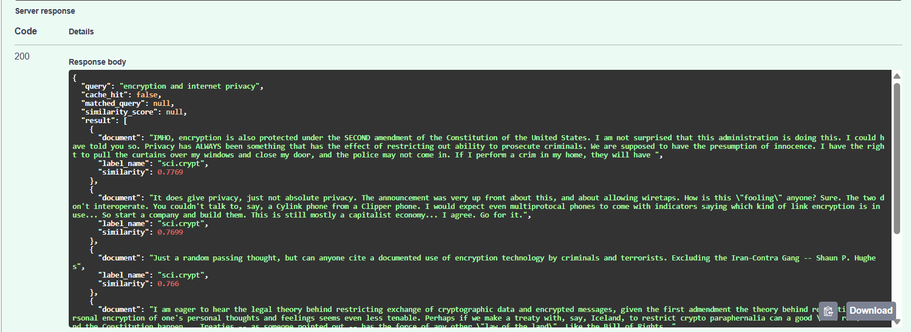
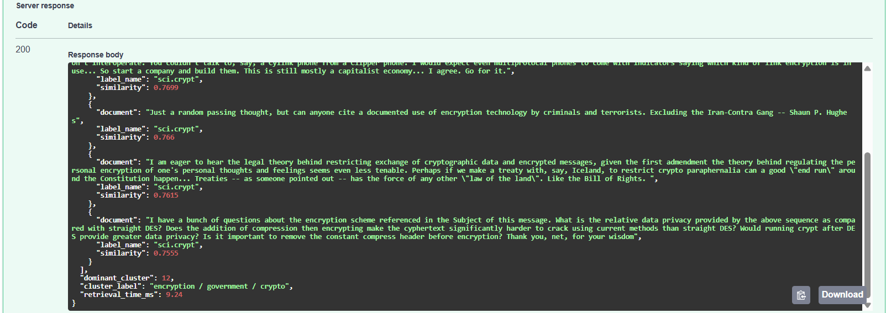
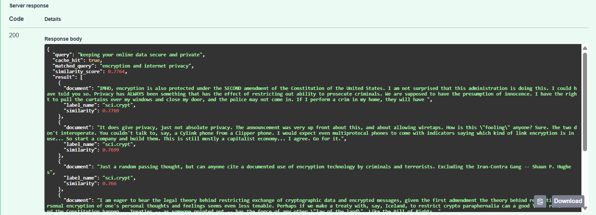
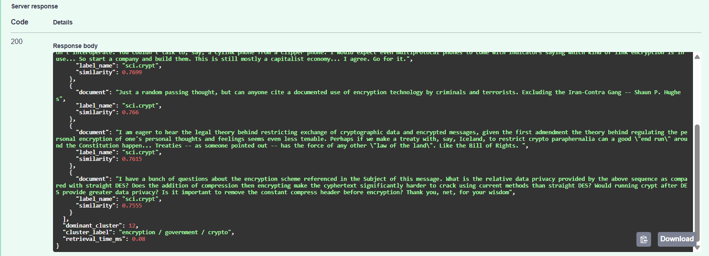
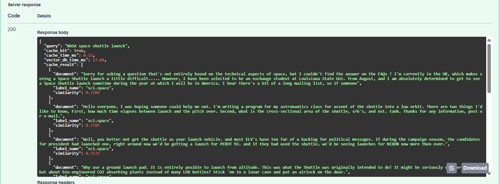
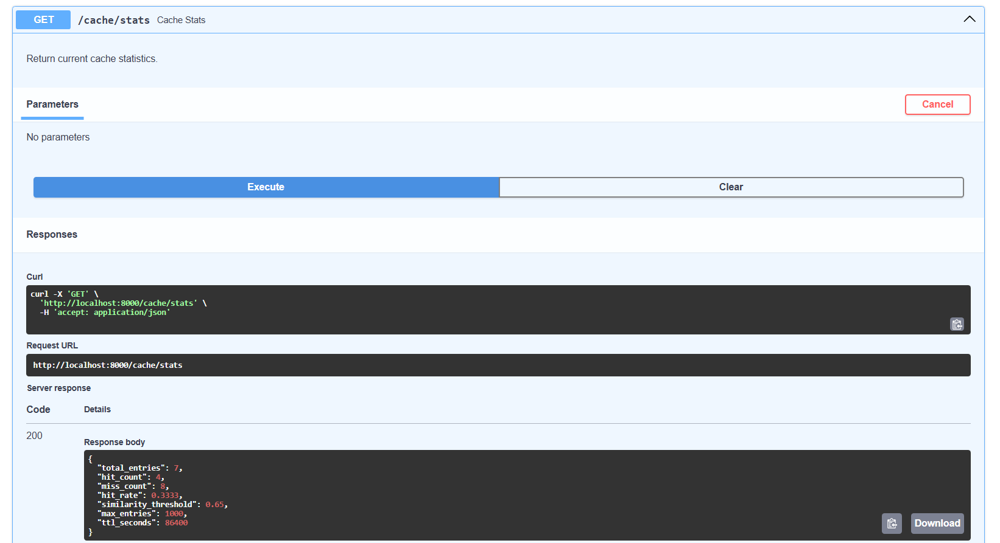
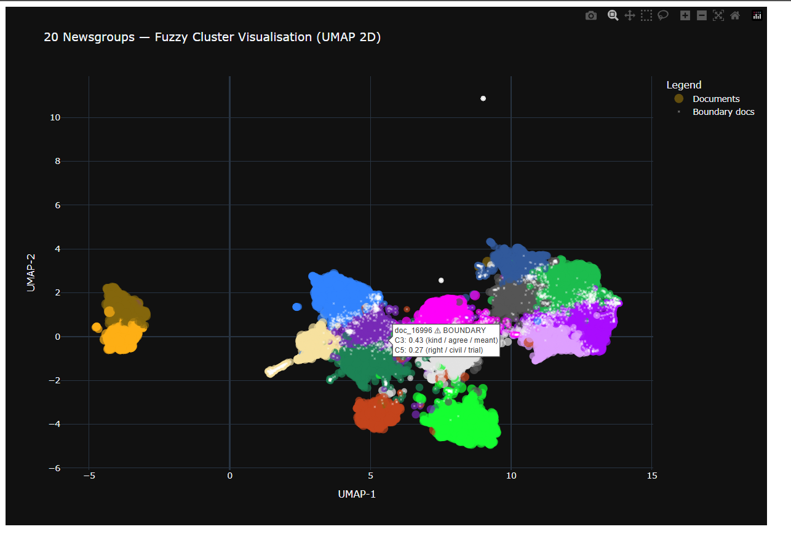

# Newsgroups Semantic Search

A semantic search engine over the 20 Newsgroups corpus (~18,000 documents). Type a natural language query and get back the most semantically similar documents — fast, with semantic caching that recognises paraphrased queries.

---

## What Makes This More Than a Basic Vector Search

- **Semantic cache** — stores past query embeddings in a Python dict; if a new query is similar enough (cosine similarity ≥ 0.65), returns the cached result without touching the vector DB
- **Two-stage UMAP + Fuzzy C-Means clustering** — groups documents into 15 soft topic clusters; each document gets a probability distribution over clusters, not a single hard assignment
- **Retrieval timing** — every response includes `retrieval_time_ms` showing exactly how long the cache lookup or vector DB search took
- **Benchmark endpoint** — runs both cache and ChromaDB for the same query and returns both timings side by side

---

## See It In Action

### Cache Miss — New Query

Query: `"encryption and internet privacy"` — never seen before, so the cache has no match. The system hits ChromaDB which searches all 16,781 documents and returns the top-5 most semantically similar results to the query. The cluster label `encryption / government / crypto` is metadata identifying which topic the query belongs to. Retrieval time: **9.24ms** (vector DB search).




---

### Cache Hit — Similar Query

Query: `"keeping your online data secure and private"` — semantically similar to the previous query. The cache finds a match with similarity score **0.7764** against `"encryption and internet privacy"` and returns the same results instantly without hitting ChromaDB at all. Retrieval time: **0.08ms** (dict lookup).




---

### Benchmark — Cache vs Vector DB Side by Side

Query: `"NASA space shuttle launch"` — already in the cache (`cache_hit: true`). The `/benchmark` endpoint runs both the cache lookup and ChromaDB search for the same query and returns both timings. Cache lookup: **0.13ms** vs ChromaDB HNSW search: **17.04ms**. The cache result and vector DB result are identical, confirming the cache is returning the right documents.



---

### Cache Stats

The `GET /cache/stats` endpoint shows the current state of the cache — 7 total entries, 4 hits, 3 misses, hit rate of 0.33, similarity threshold of 0.65, max entries 1000, TTL 86400 seconds (24h).



---

## Architecture

```
┌─────────────────────────────────────────────────────┐
│                      CLIENT                         │
│              POST /query  {"query": "..."}          │
└──────────────────────┬──────────────────────────────┘
                       │
┌──────────────────────▼──────────────────────────────┐
│               FastAPI  (routes.py)                  │
└──────┬───────────────┬──────────────────┬───────────┘
       │               │                  │
       ▼               ▼                  ▼
EmbeddingService  ClusteringService   CacheService
BGE model         centroid lookup     Python dict
(~25ms)           (~1ms)              TTL + LRU
                                           │
                                    cache hit? → return
                                           │
                                    cache miss ↓
                               VectorDBService
                               ChromaDB HNSW
                               (~50–100ms)
```

---

## Request Flow

**Every request goes through these steps:**

1. **Embed the query** — BGE-small-en-v1.5 converts the query text into a 384-dim vector (~25ms). Queries use an instruction prefix; stored documents do not (asymmetric BGE encoding).

2. **Assign to clusters** — dot product against 15 pre-computed cluster centroids identifies which topic cluster the query belongs to (~1ms).

3. **Cache lookup** — the query embedding is compared against all cached embeddings using cosine similarity. If the best match is ≥ 0.65, the cached result is returned immediately. Cache entries expire after 24h (TTL) and the oldest entries are evicted when the cache exceeds 1000 entries (LRU).

4. **Vector DB search** *(cache miss only)* — ChromaDB searches all 16,781 documents using its HNSW index and returns the top-5 most semantically similar results to the query. Result is stored in the cache for future similar queries.

5. **Response** — returns matched documents, cluster label, cache hit/miss flag, and `retrieval_time_ms`.

---

## Offline Pipeline (run once)

Before starting the server, two scripts prepare the data:

```
prepare_data.py (~20 min)
  Load 20 Newsgroups corpus → clean text → embed with BGE → store in ChromaDB
  Output: embeddings.npy (16,781 × 384), data/chroma_db/

build_clusters.py (~5 min)
  UMAP 384-dim → 50-dim → Fuzzy C-Means (15 clusters) → TF-IDF cluster labels
  UMAP 384-dim → 2-dim → interactive Plotly visualization
  Output: cluster_memberships.npy, cluster_meta.json, cluster_viz.html
```

The two UMAP stages are independent — Stage 1 uses tight packing (`min_dist=0.0`) for clustering quality; Stage 2 uses balanced parameters (`min_dist=0.1`) for readable visualization.

---

## Cluster Visualization



Each point is a document projected to 2D using UMAP. Colors represent the 15 topic clusters discovered by Fuzzy C-Means. Larger points indicate higher membership certainty. Small white dots are boundary documents that sit between two or more topics — the hover tooltip shows which clusters they partially belong to. An interactive HTML version is available at `visualizations/cluster_viz.html`.

---

## API Endpoints

| Method | Endpoint | Description |
|--------|----------|-------------|
| `POST` | `/query` | Search — returns top documents + `retrieval_time_ms` |
| `POST` | `/benchmark` | Runs both cache and ChromaDB, returns both timings |
| `GET` | `/cache/stats` | Hit rate, entry count, threshold |
| `DELETE` | `/cache` | Flush the cache |

---

## How to Run

```bash
# Install
python -m venv venv
venv\Scripts\activate
pip install torch --index-url https://download.pytorch.org/whl/cpu
pip install -r requirements.txt

# Build data — run once (~25 min total)
python scripts/prepare_data.py
python scripts/build_clusters.py

# Start server
uvicorn app.main:app --reload
# API docs → http://localhost:8000/docs
# Cluster visualization → open visualizations/cluster_viz.html
```

---

## Tech Stack

| Component | Library |
|-----------|---------|
| Embeddings | `sentence-transformers` — BAAI/bge-small-en-v1.5 |
| Vector DB | `chromadb` — HNSW index, cosine distance |
| Clustering | `scikit-fuzzy` — Fuzzy C-Means |
| Dim reduction | `umap-learn` |
| Cache | Python `dict` — in-memory, TTL + LRU |
| API | `fastapi` + `uvicorn` |
| Visualization | `plotly` |
